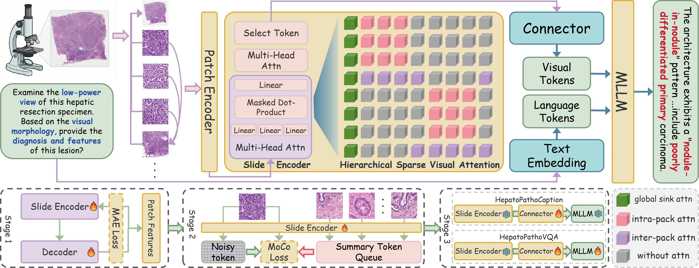

<p align="center">
  
</p>

<h1 align="center">Hepato-LLaVA: An Expert MLLM with Sparse Topo-Pack Attention for Hepatocellular Pathology Analysis on Whole Slide Images</h1>


<p align="center">
  <a></a>
  <a href="http://arxiv.org/abs/2602.19424"></a>
  <a></a>
</p>

---

## 🔥 News
- [2026/06/13] Hepto-LLaVA has been accepted at MICCAI 2026 as a poster! 🎉
- [2026/02/23] Hepto-LLaVA is now live on arXiv! 🔥

## 👀 Introduction

<p align="center">
  
</p>

Hepatocellular Carcinoma (HCC) relies on histopathological **Whole Slide Images (WSIs)** examination as the gold standard. However, manual analysis of these gigapixel, highly heterogeneous WSIs is labor-intensive and prone to inter-observer variability. This has catalyzed WSI-based **Multi-modal Large Language Models (MLLMs)** to enable VQA.

A key challenge in pathology MLLMs is gigapixel WSI representation. Existing methods either use **thumbnail-based approaches** that lose critical high-resolution diagnostic details, or employ **slide-encoder approaches** that generate excessively redundant tokens.

We propose **Hepato-LLaVA**, a specialized MLLM for fine-grained hepatocellular pathology analysis. It features a novel **Hierarchical Sparse Visual Attention (HSVA)** mechanism that models 2D tissue topology to aggregate diagnostic evidence while preserving context. To address multiscale data scarcity, we also present **HepatoPathoVQA**, comprising **33K hierarchically structured QA pairs** validated by pathologists. **Hepato-LLaVA** achieves state-of-the-art diagnostic accuracy, outperforming existing pathology MLLMs by an absolute **20%**.

## Citation

```bibtex
@article{yang2026hepatollava,
  title={Hepato-LLaVA: An Expert MLLM with Sparse Topo-Pack Attention for Hepatocellular Pathology Analysis on Whole Slide Images},
  author={Yang, Yuxuan and Yan, Zhonghao and Zhang, Yi and Yun, Bo and Diao, Muxi and Zhao, Guowei and Liang, Kongming and Li, Wenbin and Ma, Zhanyu},
  journal={arXiv preprint arXiv:2602.19424},
  year={2026}
}
```
